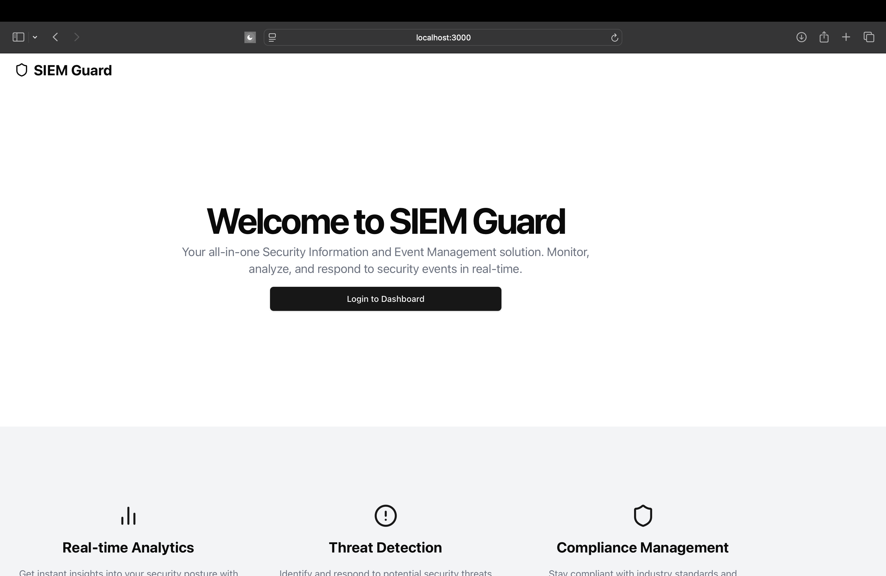
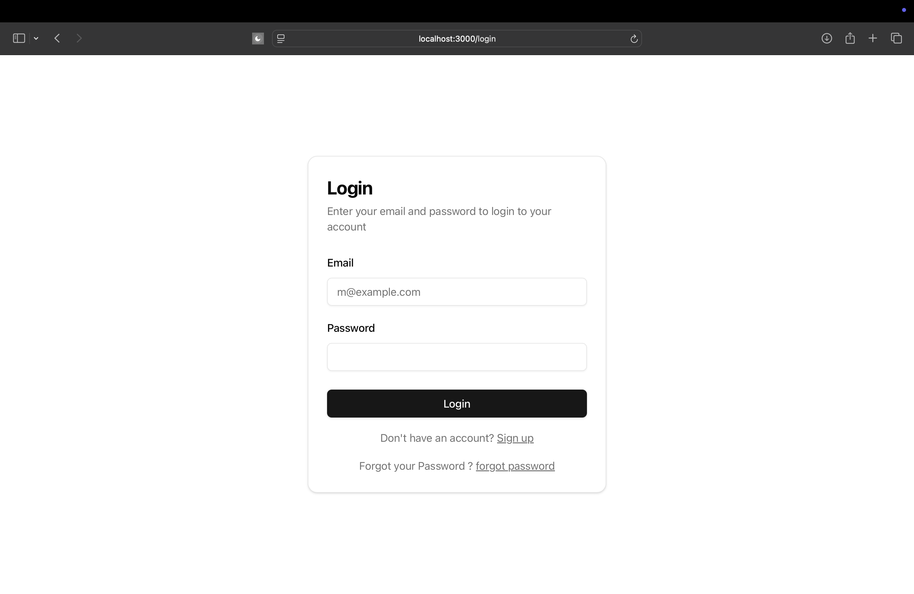
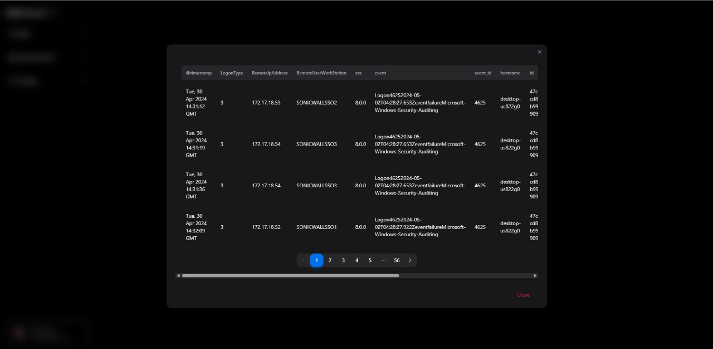
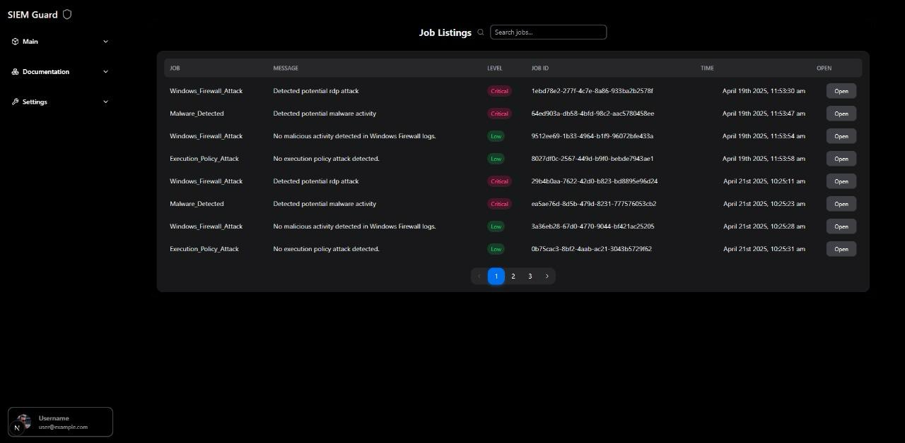
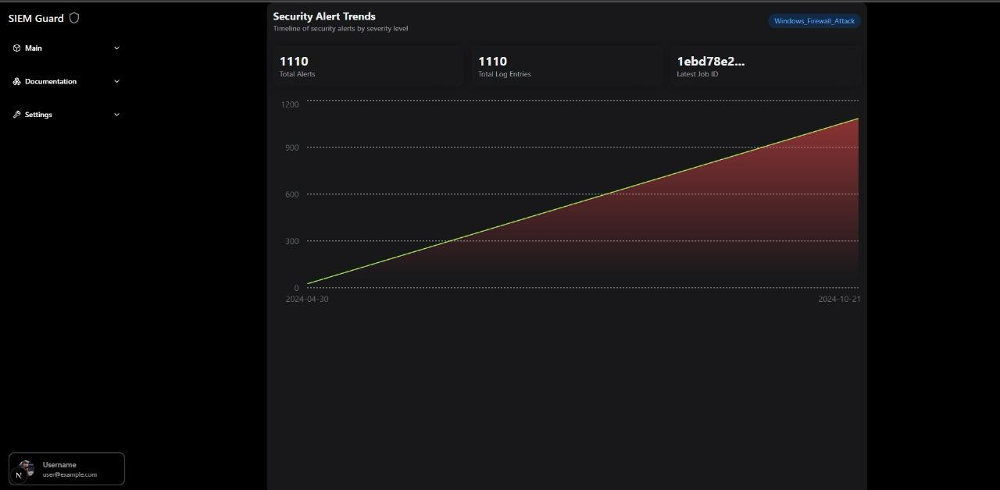
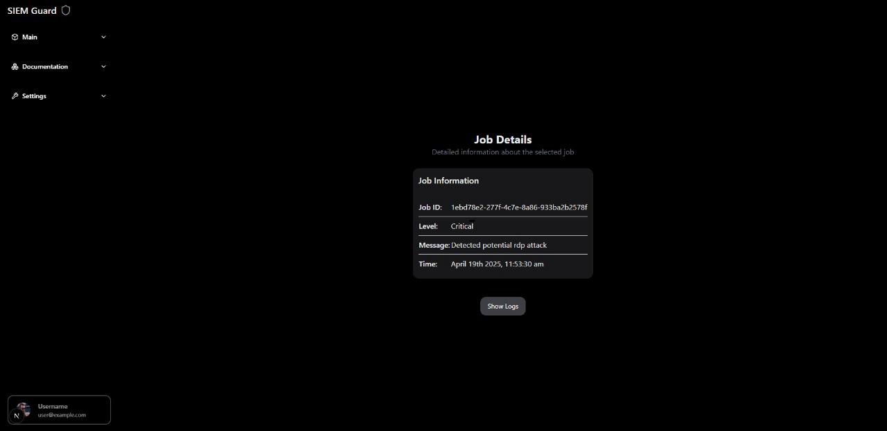
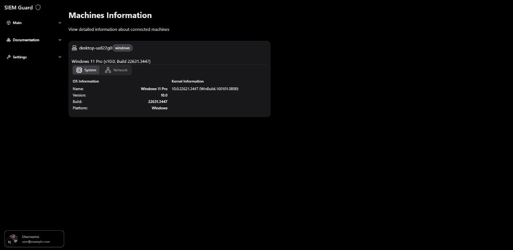
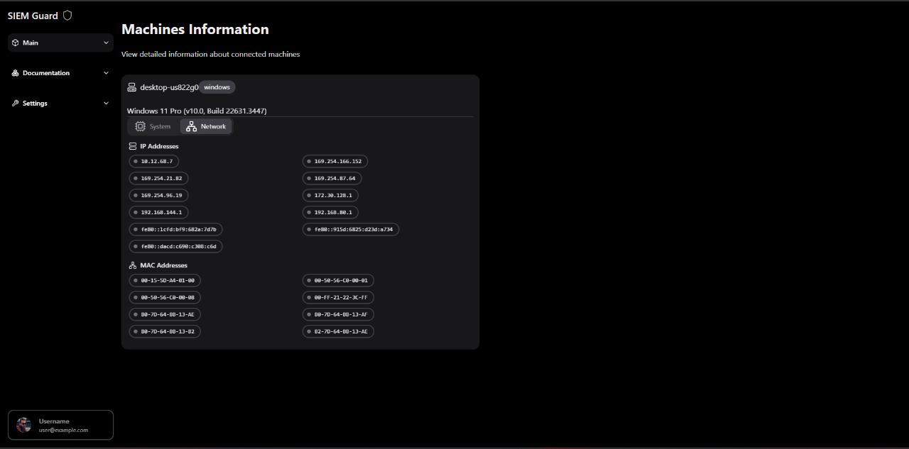
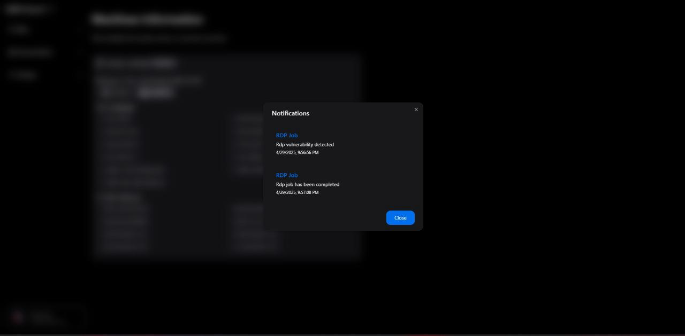

## Table of Contents

1. [Introduction](#introduction)
2. [System Architecture](#system-architecture)
3. [Core Functionalities](#core-functionalities)
4. [Deployment & Setup](#deployment--setup)
5. [How the SIEM Works](#how-the-siem-works)
6. [Usage Guide](#usage-guide)
7. [Troubleshooting & Debugging](#troubleshooting--debugging)
8. [Glossary](#glossary)
9. [Contact Information](#Contact-Information)
10. [Appendix](#Appendix)

## Introduction
### Overview
In today’s cybersecurity landscape, organizations face increasing challenges related to real-time threat detection, log analysis, and incident response. The exponential growth of security logs, coupled with the emergence of advanced persistent threats (APTs), makes conventional SIEM solutions inadequate. Legacy systems often suffer from high costs, resource-intensive deployments, and scalability issues, leading to inefficiencies in threat detection and response.

Our SIEM tool addresses these challenges by leveraging big data analytics, distributed processing, and real-time log correlation. Unlike traditional SIEM systems that rely on static rule-based detection, our solution integrates Apache Kafka for high-throughput log ingestion and PySpark for parallelized log processing. The frontend, built with Next.js and Tailwind CSS, provides a modern dashboard for visualizing and analyzing security threats efficiently.

### Motivation
Existing SIEM solutions, such as Splunk and IBM QRadar, are effective but suffer from limitations, including high operational costs, slow detection, and a high volume of false positives. This project aims to build a lightweight, cost-effective, and scalable SIEM tool that overcomes these limitations through real-time log correlation and anomaly detection.
### Objectives
The primary goal of this project is to develop a high-performance SIEM tool that provides real-time threat detection, scalability, and cost efficiency. The tool aims to:
1. Enable centralized log collection and processing.
2. Detect threats in real-time using correlation and anomaly detection techniques.
3. Provide a user-friendly dashboard for visualization and alert management.
4. Enhance scalability through distributed log processing.
## System Architecture

### High-Level Architecture

The SIEM system employs a modular architecture where specialized services handle different aspects of security monitoring. This design ensures scalability and maintainability while allowing components to be upgraded or replaced independently.

The system follows this data processing flow:
```
Log Sources → Winlogbeat (Windows Logs) → Kafka (Transport) → PySpark (Processing & Correlation Engine) → MongoDB (Storage) → Frontend Dashboard (Visualization & Reporting)
```


The SIEM tool follows a modular and scalable architecture, utilizing open-source technologies for enhanced performance. The core components include:
1. Log Collection (Winlogbeat): Collects Windows security logs and forwards them to Kafka.
2. Log Transport (Apache Kafka): Manages high-throughput log transmission.
3. Log Processing (PySpark): Applies correlation rules and performs real-time analysis.
4. Data Storage (MongoDB): Stores processed logs and analysis results for querying and reporting.
5. Visualization (Next.js Dashboard): Presents interactive data visualization and real-time alerts.
### Data Flow

The system processes security data through five key stages:

1. **Log Collection**: Windows Event Logs are gathered using Winlogbeat, which monitors system activities and security events in real-time.

2. **Log Transport**: Kafka serves as a message broker, ensuring reliable and scalable log transmission to the processing engine. This decoupling allows for system resilience and scalability.

3. **Processing & Correlation**: PySpark analyzes the incoming logs, applying sophisticated correlation rules to detect patterns indicating potential security threats.

4. **Storage**: Processed logs and analysis results are stored in MongoDB, providing efficient retrieval and querying capabilities.

5. **Visualization & Alerts**: The frontend dashboard presents security insights through interactive visualizations and real-time alerts.

### Components Overview

Each component in the system serves a specific purpose:

1. **Winlogbeat**: A lightweight agent that efficiently collects and forwards Windows security logs to Kafka.

2. **Kafka**: A distributed messaging system that ensures reliable log transport and acts as a buffer during high-volume periods.

3. **PySpark**: The processing engine that applies correlation rules and performs real-time analysis of security events.

4. **MongoDB**: A NoSQL database that provides flexible storage and efficient retrieval of security events and analysis results.

5. **Frontend (Next.js + Tailwind CSS)**: A modern web interface that presents security data through intuitive dashboards and interactive reports.

## Core Functionalities

The SIEM system provides comprehensive security monitoring capabilities:

1. **Real-Time Log Processing**: The system ingests and analyzes logs as they are generated, enabling immediate threat detection.

2. **Correlation Engine**: Advanced algorithms detect complex threat patterns such as brute-force attempts, privilege escalations, and suspicious login activities.

3. **Dashboard & Reporting**: Interactive visualizations and customizable reports help security teams understand their threat landscape.

4. **Scalability**: The architecture supports deployment across enterprise environments with multiple log sources and high event volumes.

## Deployment & Setup

### Prerequisites

Before beginning the installation, ensure your environment has these components:

- Docker & Docker Compose (for containerized deployment)
- MongoDB (minimum version 4.4)
- Apache Kafka & Zookeeper (latest stable release)
- Winlogbeat (compatible with your Windows version)
- Python 3.8+ (for PySpark processing engine)
- Node.js 14+ & npm (for frontend UI)

### Front-End Folder Structure

The front-end folder structure follows a modular architecture to ensure scalability and maintainability. Here’s a breakdown:
- *Dockerfile & docker-compose.yml*: Containerization and orchestration.
- *src/app*: Contains application pages and authentication modules.
- *src/components*: UI components and reusable elements.
- *src/db*: Database configurations and schema definitions.
- *src/lib*: Utility functions and authentication methods.
- *src/hooks*: Custom React hooks for responsive designs.
- *tailwind.config.ts*: Tailwind CSS configurations.
- *public/assets*: Stores static files, including images and icons.
### Installation Steps

#### Step 1: Clone the SIEM Repository

```bash
git clone https://github.com/Ashborn013/SIEM_TOOL.git
cd SIEM_TOOL
```

#### Step 2: Configure Kafka for Log Ingestion

1. Navigate to the Kafka configuration directory:
```bash
cd message-kafka-docker
```

2. Start Kafka and Zookeeper using Docker Compose:
```bash
docker-compose -f zk-single-kafka-single.yml up -d
```

1. Verify Kafka is running:
```bash
docker ps | grep kafka
```

**Kafka Configuration (zk-single-kafka-single.yml):**

```yaml
services:
  zoo1:
    image: confluentinc/cp-zookeeper:7.3.2
    hostname: zoo1
    ports:
      - "2181:2181"
    environment:
      ZOOKEEPER_CLIENT_PORT: 2181

  kafka1:
    image: confluentinc/cp-kafka:7.3.2
    hostname: kafka1
    ports:
      - "9092:9092"
      - "29092:29092"
    environment:
      KAFKA_ADVERTISED_LISTENERS:
      <Truncated>
```
#### Step 3: Configure Winlogbeat

**Winlogbeat Configuration (winlogbeat.yml):**
```yaml
winlogbeat.event_logs:
  - name: Security
  - name: System
  - name: Application

output.kafka:
  hosts: ["localhost:9092"]
  topic: "security-logs"
  compression: gzip
  required_acks: 1
```

Deploy as a service:

```powershell
cd C:\Program Files\Winlogbeat
winlogbeat.exe install
winlogbeat.exe start
```

#### Step 4: Deploy the Correlation Engine

```bash
docker compose up -d pyspark-app spark spark-worker
docker logs <pyspark_container_id>  # Verify deployment
```

#### Step 5: Initialize MongoDB

```bash
docker compose up -d mongo
```

#### Step 6: Launch the API Server

```bash
docker compose up -d flask-server
```

#### Step 7: Deploy the Frontend

```bash
cd front-end-ui-v4
npm install
npm run dev
```


> ⚠️ **Lost or confused?** Just scroll to the end for the **Contact Information** section—your one-stop shop for help and support! 😄

### Dashboard Navigation

The dashboard is designed to offer intuitive navigation through various modules and pages. Below are the primary navigation paths and their purposes:
#### Authentication Pages
- *Login Page*: Accessible at `/login`, used for user authentication.
- *Sign-Up Page*: Accessible at `/signup`, used for new user registration.
- *Forgot Password*: Accessible at `/forgotpassword`, for password recovery.
- *Reset Password*: Accessible only through forgot password page, for resetting the password a random token is used and cannot be reused.
#### User Pages
- *Dashboard*: Accessible at `/user/dashboard`, displays a real-time overview of security events and logs.
- *Machines*: Accessible at `/user/machines`, provides details on monitored machines and their security status.
- *Reports*: Accessible at `/user/report`, shows detailed security reports and analysis.
- *Dynamic Report View*: Accessible at `/user/report/[job_id]`, displays a specific report based on the job ID.
## How the SIEM Works

### Log Ingestion & Processing

The system employs a sophisticated pipeline for processing security logs:

1. Winlogbeat monitors Windows systems for security events
2. Kafka ensures reliable transport of these events
3. PySpark applies correlation rules to detect security incidents

### Correlation Engine

The engine focuses on these primary detection categories:

1. Brute-Force Detection: Identifies repeated failed login attempts
2. Privilege Escalation Tracking: Monitors suspicious privilege changes
3. Malicious RDP Login Analysis: Detects unusual remote access patterns
4. Malware Detection : Detects unusual malware triggered events
5. Windows Firewall Attack : Detects firewall policy changes
6. Windows Execution Policy Attack : Detects changes in execution policy via scripts.

### Data Storage & Retrieval

MongoDB provides flexible storage and efficient querying capabilities for security events and analysis results.

### Web Interface

The Next.js dashboard offers:
- Real-time security monitoring
- Interactive data visualization
- Alert management
- Incident reporting

## Usage Guide

### Accessing the SIEM Dashboard

1. Navigate to  `http://localhost:3000`
2. Log in using your credentials
3. Access security insights through the interactive dashboard

### Managing Risks & Alerts

The system provides comprehensive alert management capabilities:
- Real-time alert notifications
- Incident investigation tools
- Alert prioritization and tracking
- Response workflow management

## Troubleshooting & Debugging
### Common Issues & Fixes

| Issue                 | Cause                    | Fix                                          |
| --------------------- | ------------------------ | -------------------------------------------- |
| Kafka not starting    | Port conflict            | Change ports in `zk-single-kafka-single.yml` |
| No logs in MongoDB    | Winlogbeat misconfigured | Check `winlogbeat.yml` settings              |
| Front end not loading | API server down          | Restart Flask & check logs                   |

### Common troubleshooting commands:

- Check Kafka status:
```bash
docker logs kafka
```

- Verify Winlogbeat operation:
```bash
.\winlogbeat test output
```

- Check MongoDB logs:
```bash
docker exec -it mongo mongo
use securityDB
db.logs.find()
```

## Glossary

 **Alert Fatigue**
- A state where security analysts become desensitized to alerts due to the high volume of false positives, leading to missed or overlooked security incidents.

 **Anomaly Detection**
- A technique used to identify unusual patterns or behaviors in data that do not conform to expected norms, often indicating potential security threats.

**Apache Kafka**
- An open-source distributed event streaming platform used for high-throughput, real-time log ingestion and message transport.

**Apache Spark**
- A unified analytics engine for large-scale data processing, used for parallelized log processing and correlation.

**Big Data Analytics**
- The process of analyzing large and complex data sets to uncover hidden patterns, correlations, and insights.

**Brute Force Attack**
- An attack that attempts to gain unauthorized access by systematically trying multiple combinations of credentials.

**Containerization**
- Packaging applications and their dependencies into a single container to ensure consistent deployment across environments, commonly using Docker.

**Correlation Engine**
- A component that analyzes and correlates security logs to detect complex attack patterns or anomalies.

**Dashboard**
- A graphical user interface that provides real-time visualization and monitoring of security logs and correlated events.

**Data Ingestion**
- The process of collecting and importing data from various sources to be processed and analyzed.

**Distributed Processing**
- Performing data processing tasks across multiple nodes or machines to enhance speed and efficiency.

**False Positive**
- An alert that incorrectly indicates the presence of a threat or security incident when none exists.

**Frontend (Next.js)**
- The user interface of the SIEM tool, built using the Next.js framework for interactive and dynamic visualization.

**Log Correlation**
- The process of linking and analyzing logs from multiple sources to detect suspicious patterns or attacks.

**Log Forwarder (Winlogbeat)**
- A lightweight shipper that collects and forwards Windows event logs to a centralized logging system.

**Malware Execution**
- The act of running malicious software on a system, often detected through abnormal process executions or suspicious script activities.

**MongoDB**
- A NoSQL database used for storing processed and correlated logs to support fast querying and analysis.

**Real-Time Detection**
- The ability to identify and respond to threats as they occur, minimizing delay in threat response.

**Rule-Based Detection**
- A method that uses predefined rules to identify known attack patterns and generate alerts.

**Security Information and Event Management (SIEM)**
- A system that provides real-time analysis of security alerts generated by applications and network hardware.

**Threat Intelligence**
- Data and insights used to identify and understand potential and existing threats to cybersecurity.

## Contact Information
For assistance or inquiries related to specific components of the SIEM tool, please reach out to the designated team members:

| Component                                   | Description                                           | Contact Person                          | Email                                                                                                                        |
| ------------------------------------------- | ----------------------------------------------------- | --------------------------------------- | ---------------------------------------------------------------------------------------------------------------------------- |
| Log Collection (Winlogbeat)                 | Configuration and setup of log collection agents      | Arjun C Santhossh                       | cb.en.u4cys21010@cb.students.amrita.edu                                                                                      |
| Log Transport (Apache Kafka)                | Kafka broker setup and message transport issues       | Arjun C Santhossh,<br>Hem Sagar         | cb.en.u4cys21010@cb.students.amrita.edu,<br>cb.en.u4cys21016@cb.students.amrita.edu                                          |
| Log Processing (PySpark)                    | Correlation engine and threat detection logic         | Hem Sagar, <br>Madhav Harikumar         | cb.en.u4cys21016@cb.students.amrita.edu,<br>cb.en.u4cys21038@cb.students.amrita.edu                                          |
| Data Storage <br>(MongoDB) and Flask Server | Database configuration and data retrieval             | Nishanth S                              | cb.en.u4cys21050@cb.students.amrita.edu                                                                                      |
| Front-End Dashboard (Next.js)               | UI development, dashboard features, and customization | Arjun C Santhossh                       | cb.en.u4cys21010@cb.students.amrita.edu                                                                                      |
| Conference Paper / Documentation            | Content of paper and Documentation                    | Madhav Harikumar, Hem Sagar, Nishanth S | cb.en.u4cys21038@cb.students.amrita.edu,<br>cb.en.u4cys21016@cb.students.amrita.edu, cb.en.u4cys21050@cb.students.amrita.edu |
| General Project Queries                     | Overall project management and coordination           | Any of the Above Members                | Refer Above.                                                                                                                 |
## Appendix

### Appendix A: Dashboard Images
This appendix contains visual representations of the SIEM tool dashboard, highlighting various features and navigation paths. The following images are included:

1. **Login Page:** Shows the user authentication interface, allowing secure access to the SIEM dashboard.  
2. **Dashboard Overview:** Real-time visualization of security logs, correlated events, and alerts.  
3. **Machines Page:** Displays the list of monitored machines and their security status.  
4. **Report Page:** Provides detailed reports of security incidents and log analysis.  
5. **Alert Management:** Interface for configuring alerts and monitoring active threats.  

> **Note:** Images are annotated to describe key features and interface elements for better understanding.  












---
### Appendix B: Correlation Rules
This appendix includes the most important correlation rules used in the SIEM tool to detect potential threats and malicious activities. Below are some key rules:  

1. **Brute Force Attack Detection Rule:**  
   - *Condition:* Multiple failed login attempts (Event ID: 4625) within a short time window (less than 60 seconds).
   - *Threshold:* More than 10 failed RDP login attempts within 1 minute.  
   - *Action:* Trigger an alert indicating a potential RDP brute force attack.  
```
# Detect RDP brute force attempts
logs_under_one_min = out_put.filter(col("time_diff") < 60)
count = logs_under_one_min.count()

if count > 10:
    logging.info("RDP Brute Force attempt detected .. !")
```
